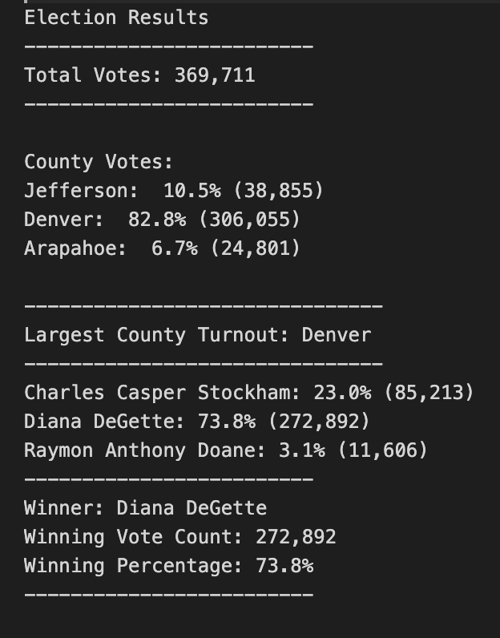

# election_analysis

In this election audit, we have calculated the data showing the number of votes total, per county, as well as the amount each candidate received and the winner of the election.

## Election Audit Results

* The total votes cast in this election was 369,711
* The county with the largest turnout was Denver, with 82.8% of the total and 306,055 votes. 
  -Jefferson's turnout was equal to 10.5% and 38,855 votes. 
  -Leaving Arapahoe at 6.7% with 24,801 votes.
* The winner of the election was Diana DeGette, at 73.8% and 272,892 votes. 
  -Charles Casper Stockham was runner-up at 23% wit 85,213 votes.
  -Raymon Anthony Doane at 3.1% with 11,606 votes in last place.

## Election Audit Summary

* From the way this script is designed to condense data, it can be invaluable in other elections with the proper modifications. One way to possibly modify would be to change the "county" categories to states for a larger election pool. The candidate names can also be modified to reflect that change, or to change the candidates in other state elections.

